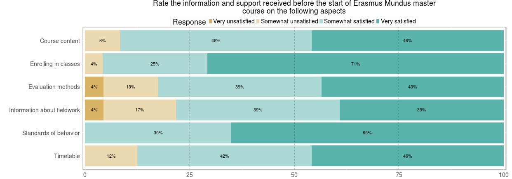

### Course Quality of Student Services survey
This is the **second edition** of CQSS survey. The current edition of the survey brings a number of improvements. Many of these **improvements resulted d from the feedback of the EMJMD consortia** and **Erasmus Mundus students**. At the recommendation of EMJMD consortia, the course reports now include **comparative information** about each course in relation to the other EMJMD courses that received a sufficient number of responses. At the suggestion of survey respondents, the 2015 CQSS survey edition was released at the end of the academic year, to ensure that all respondents completed at least two EMJMD semesters before evaluating their experience. Additional changes have been made to the 2015 edition of the CQSS survey to streamline the survey experience, to facilitate the data analysis process, and to capture information about key subpopulations among EMJMD students.  For further reference, a **full description of the methodology** behind the creation of the 2015 edition of the CQSS survey and the analysis procedures behind the CQSS reports was published in the first 2016 edition of the academic journal <a href="https://vo.hse.ru/en/2016--1/178804999.html" target = "_blank" onclick="ga('send', 'event', 'click', 'link', 'journal', 1)">Education Studies Moscow</a>.

### Sources of data
The interactive tool provides information about EMJMD programs that received 10 or more answers in the CQSS survey.

It introduces two distinct sources of information. **First**, responses are displayed in graphical form for each indicator and dimension captured in the CQSS survey. Questions appears as the figure or dimension title, with each comprising indicator listed on a separate row. The figure below illustrates the proportion of respondents that selected each of the four available Likert scale options.

 

 

 

**Second**, for each indicator evaluated through the CQSS survey, comparative data on the aggregated performance among all EMJMD courses with 10 or more responses is introduced.

