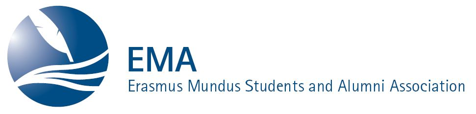

### Erasmus Mundus Students and Alumni Association

The Erasmus Mundus Students and Alumni Association (EMA) is a network for students and alumni of all Erasmus Mundus Joint Master and PhD Programmes.

Erasmus Mundus offers scholarships for students and academics from all over the world. The mission of the Association is to serve the interests of Erasmus Mundus Students and Alumni, notably by providing a forum for networking, communication and collaboration, and by promoting Erasmus Mundus as a European programme of excellence in international education.

EMA was established in 2006 as an  initiative of the Directorate General for Education and Culture of the European Commission. The Association was driven by the Erasmus Mundus students from the very start and has developed into a dynamic and democratic organisation.

You can learn more about EMA [here](http://em-a.eu/)!

